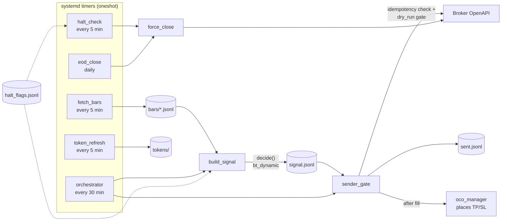

[🇯🇵 日本語](README.md) | [🇬🇧 English](README.en.md)

# live-dynamic

[](https://github.com/yktsnet/live-dynamic/actions/workflows/ci.yml)

A live execution layer that connects a strategy validated with [bt-dynamic](https://github.com/yktsnet/bt-dynamic) (dynamic-regime backtesting) to a broker's OpenAPI **with the same decision code and the same config**. Decisions never touch the broker; all the execution layer adds is lot sizing and safety devices — an idempotent order gate, reconciling OCO, EOD close, and a kill switch. The formula you validated and the formula you run stay identical, unattended on systemd timers.

> **Disclaimer**: This repository is a reference implementation of trading-operations design, not investment advice. Use with real money at your own risk. The default mode is dry_run (no orders are sent); live trading requires an explicit switch.


(The demo runs on synthetic data with didactic placeholder settings. Regenerate with `nix-shell --run 'vhs examples/demo.tape'`.)

## Quick Start

You can run the whole pipeline from synthetic data — no credentials, no network.

```bash
pip install -r requirements.txt   # on Nix: nix-shell

export LIVE_DYNAMIC_DATA=~/live_dynamic_data
export MARKET_DATA=~/market_data
export BT_DYNAMIC_CONFIG=examples/config.json
export PYTHONPATH=.

python examples/generate_bars.py   # generate synthetic 5-minute bars
python core/orchestrator.py        # decision -> order gate (dry_run by default)

cat $LIVE_DYNAMIC_DATA/state/signal.jsonl   # strategy decisions
cat $LIVE_DYNAMIC_DATA/state/sent.jsonl     # send records with dry_run=true
```

## Architecture

Signal generation (`build_signal`) and order sending (`sender_gate`) are deliberately separated. The former never talks to the broker, so it can be verified without credentials; the only thing between them is the append-only `signal.jsonl`.



## Safety Design

This is the heart of the repository. Even a correct strategy loses money if the execution layer is broken. The invariants protecting real funds are published as-is, with the code and tests that enforce them.

- **Idempotency**: `sender_gate` checks the decision slot (`time_utc`) against the send log (`sent.jsonl`) and never sends the same slot twice. Overlapping timer runs and manual reruns are safe
- **dry_run by default**: `ENABLE_EXEC_REQUESTS=0` is the default. Switching to live is one line in an env file, no restart required. If you forget to switch, it fails toward not trading
- **Layered fail-safes**: an OCO (TP/SL) bracket placed right after entry, a forced end-of-day close at the session cutoff, and an external kill switch. If any one layer dies, the others still flatten the position
- **Kill switch**: append one line to `state/halt_flags.jsonl` and signal generation stops while open positions are force-closed within 5 minutes. The writer can be an anomaly detector or a human with a text editor — that minimal interface is the point
- **Operational discipline**: every state file is written atomically (`.tmp` → `os.replace`) and append-only. EOD and the kill-switch check are themselves idempotent via date keys and slot keys

## Tech Stack

| Layer | Technology | Reason |
|---|---|---|
| Strategy decisions | [bt-dynamic](https://pypi.org/project/bt-dynamic/) (PyPI) | Production decisions run the same code and same config as the backtest, closing the research/production gap structurally |
| Data processing | Python + pandas | Same foundation as bt-dynamic's indicators; the execution layer adds no numerical code of its own |
| Broker API | Standard library only (urllib) | Minimal dependencies on the order path; third-party HTTP libraries are a failure point and a supply-chain risk |
| Scheduling | systemd timers (oneshot) | No resident process: there is no "the process is dead" state, and all state lives in files |
| Service definition | Nix (`live-dynamic-service.nix`) | Timers, environment, and the Python environment are pinned declaratively and reproducibly |
| State | JSONL (append-only) | Auditable with grep/tail; having no database keeps recovery and debugging simple |

## Design Decisions

Highlights only; the full log is in [docs/design-decisions.en.md](docs/design-decisions.en.md).

- **Backtest and production share one decision**: decisions call the same bt-dynamic functions with the same config. The engine's one-bar shift (indicators at bar close, entry at the next bar's open) kills lookahead bias and simultaneously matches the live reality that a 5-minute bar is not instantly final — so validated and executed fill conditions coincide
- **Ask the broker for the position**: computing and holding position state locally looks easy and turns out to be too hard to get right — that was the production lesson. Enter on every signal, let the broker net out, and size the OCO from the position the API reports
- **OCO reconciles after the fill**: never trust that brackets are placed; every run compares them against the current position, cancels stale orders, and places only what is missing. Partial failures and rate limits self-heal on the next run
- **No resident processes**: every script runs oneshot to completion. There is no "dead but unnoticed" state, and concurrency is handled by idempotency keys, not locks
- **Keep it small enough to hold in your head**: a system trusted with real money prioritizes one person being able to read all of it over feature completeness. Decisions, orders, closes, and failure behavior fit in one evening of reading

## Scope

**Focus**

- Unattended live execution of a validated strategy, and its safety design (idempotency, dry_run, fail-safes)
- Single instrument, single position, bracket (OCO) orders
- Declarative scheduling with systemd + Nix

**Out of Scope**

- Production strategy values, results, or instruments (externally injected; never in the repo or docs)
- Identifying information about the actual broker (name, URLs, defaults)
- Monitoring dashboards and P/L analytics (the predecessor had them; they are not the execution layer's concern)
- Multiple instruments, multiple positions, partial closes

## Configuration

Put connection settings in `$LIVE_DYNAMIC_DATA/env/.env.trade.base` (**all values below are dummies**):

```
ACCOUNT_KEY=xxxx
CLIENT_KEY=xxxx
BROKER_CLIENT_ID=xxxx
BROKER_AUTH_BASE=https://auth.example-broker.com
BROKER_REDIRECT_URI=http://localhost:8080/callback
BROKER_API_BASE=https://api.example-broker.com/openapi
INSTRUMENT_ID=999
ASSET_TYPE=FxSpot
LOT_SIZE=10000
PIP_SIZE=0.01
TICK_SIZE=0.001
RR_PIPS_TP=20
RR_PIPS_SL=10
BT_DYNAMIC_CONFIG=/path/to/your/config.json
```

There are no default URLs in the code: if the env files don't provide them, nothing runs.

Order sending is controlled by `$LIVE_DYNAMIC_DATA/env/.env.live_dynamic`:

```
ENABLE_EXEC_REQUESTS=0   # dry_run (default). Set to 1 for live orders
LOT_BASE=0.1
```

Strategy parameters (cell mapping, thresholds, TP/SL, decision interval, session hours) live in the config JSON pointed to by `$BT_DYNAMIC_CONFIG` — the same format as bt-dynamic. [examples/config.json](examples/config.json) shows textbook placeholder values.

### Kill Switch

Append to `$LIVE_DYNAMIC_DATA/state/halt_flags.jsonl`:

```
{"ts": "2026-01-05T09:00:00Z"}                                    # halt that whole UTC day
{"start": "2026-01-05T12:00:00Z", "end": "2026-01-05T14:00:00Z"}  # halt a window
{"start": "2026-01-05T12:00:00Z"}                                 # halt from then on
```

### systemd (NixOS / home-manager)

```nix
services.live-dynamic = {
  enable = true;
  user = "youruser";
  appRoot = "/home/youruser/live-dynamic";
  dataRoot = "/home/youruser/live_dynamic_data";
  marketDataRoot = "/home/youruser/market_data";
  orchestrator = true;   # Mon-Fri, every 30 min during the session
  haltCheck = true;      # Mon-Fri, every 5 min
  eodClose = true;       # Mon-Fri, at session end
  tokenRefresh = true;   # every 5 min, always
  fetchBars = true;      # every 5 min, always
};
```

## Development

```bash
nix-shell --run "PYTHONPATH=. pytest tests -q"   # without Nix: pip install -r requirements.txt pytest
```

The tests cover the idempotent send gate, kill-switch evaluation, bar loading, and the strategy's decision gates — all against temporary directories and synthetic data (no network, no credentials). CI runs the same suite.
