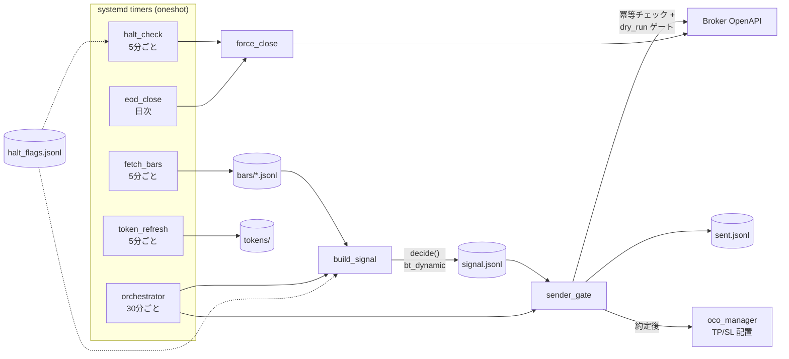

[🇯🇵 日本語](README.md) | [🇬🇧 English](README.en.md)

# live-dynamic

[](https://github.com/yktsnet/live-dynamic/actions/workflows/ci.yml)

[bt-dynamic](https://github.com/yktsnet/bt-dynamic)（動的レジーム切替バックテスト）で検証した戦略を、**同一の判定コード・同一の config のまま**実弾に接続する実行層。判定はブローカーに触れず、実行層が足すのはロット計算と安全装置——冪等な発注ゲート・照合型 OCO・EOD 決済・キルスイッチ——だけである。検証した式と運用する式を一致させたまま、systemd timer で無人運転する。

> **免責**: 本リポジトリは自動売買の運用設計を示す参照実装であり、投資助言ではない。実弾での利用は自己責任で行うこと。既定は dry_run（発注しない）であり、実発注には明示的な切替が必要。


（デモは合成データ × 説明用ダミー設定。`nix-shell --run 'vhs examples/demo.tape'` で再生成できる）

## Quick Start

資格情報もネットワークも不要で、合成データからパイプラインを一周できる。

```bash
pip install -r requirements.txt   # Nix 環境なら: nix-shell

export LIVE_DYNAMIC_DATA=~/live_dynamic_data
export MARKET_DATA=~/market_data
export BT_DYNAMIC_CONFIG=examples/config.json
export PYTHONPATH=.

python examples/generate_bars.py   # 合成5分足を生成
python core/orchestrator.py        # 判定 → 発注ゲート（既定 dry_run）

cat $LIVE_DYNAMIC_DATA/state/signal.jsonl   # 戦略判定の出力
cat $LIVE_DYNAMIC_DATA/state/sent.jsonl     # dry_run=true の送信記録
```

## Architecture

シグナル生成（`build_signal`）と発注（`sender_gate`）は意図的に分離している。前者はブローカーに一切接続しないため資格情報なしで検証でき、間をつなぐのは追記専用の `signal.jsonl` だけである。



## Safety Design

このリポの本体。戦略が正しくても実行層が壊れていれば資金は守れない。実弾で守っている不変条件を、そのままコードとテストで公開している。

- **冪等性**: `sender_gate` は送信済み記録（`sent.jsonl`）と判定スロット（`time_utc`）を照合し、同じスロットでは二度発注しない。timer の再実行・手動実行が重なっても安全
- **dry_run 既定**: `ENABLE_EXEC_REQUESTS=0` が既定。実発注への切替は env ファイル1行で、再起動不要。切替を忘れて動かしても発注されない側に倒れる
- **多層フェイルセーフ**: エントリー直後の OCO（TP/SL）自動配置、セッション終了時の EOD 強制決済、外部キルスイッチの三段構え。どれか一つが死んでも残りが建玉を閉じる
- **キルスイッチ**: `state/halt_flags.jsonl` に1行追記すればシグナル生成が止まり、建玉は5分以内に強制決済される。書き込むのが異常検知システムでもエディタを開いた人間でもよい、という最小のインターフェースにしてある
- **運用の規律**: 状態ファイルはすべて atomic write（`.tmp` → `os.replace`）・追記専用。EOD とキルスイッチも日付キー・スロットキーで冪等

## Tech Stack

| Layer | Technology | Reason |
|---|---|---|
| 戦略判定 | [bt-dynamic](https://pypi.org/project/bt-dynamic/) (PyPI) | バックテストと同一コード・同一 config で本番判定する。研究と本番の乖離を仕組みで塞ぐ |
| データ処理 | Python + pandas | bt-dynamic の指標計算と同じ基盤。実行層に独自の数値処理を持ち込まない |
| ブローカー API | 標準ライブラリのみ（urllib） | 発注経路の依存を最小化する。requests 等の外部依存は障害点と供給網リスクになる |
| スケジューリング | systemd timer（oneshot） | 常駐プロセスを持たない。プロセスが死んでいる状態がない・状態はすべてファイルにある |
| サービス定義 | Nix (`live-dynamic-service.nix`) | timer・環境変数・依存 Python 環境を宣言的に固定し、ホストへ再現可能に配備する |
| 状態管理 | JSONL（追記専用） | grep / tail で監査できる。DB を持たないことで復旧とデバッグが単純になる |

## Design Decisions

要点のみ。全文は [docs/design-decisions.md](docs/design-decisions.md)。

- **バックテストと本番を同一の判定にする**: 判定は bt-dynamic の同じ関数を同じ config で呼ぶ。エンジンの1本ずらし（指標はバー確定時点・エントリーは次バー open）は先読みバイアス潰しであると同時に、5分足が瞬時に確定しない本番の現実に合わせた形であり、これによって検証と運用の約定条件が一致する
- **建玉はブローカーに問う**: ローカルで建玉を計算・保持するのは一見簡単に見えてロジックが難しすぎる、というのが本番で得た結論。毎回エントリーしてネットアウトはブローカーに任せ、OCO の量も API の建玉から計算する
- **OCO は約定後に照合して揃える**: 配置済みを信じず、実行のたびに建玉と突き合わせて古い注文を掃除し不足だけを置く。途中失敗やレート制限があっても次の実行で自己修復する
- **常駐プロセスを持たない**: 全スクリプトが oneshot で走り切る。「死んでいるのに気づかない」状態を持たず、同時実行はロックでなく冪等キーの照合で防ぐ
- **把握しきれる大きさに保つ**: 実弾を任せる系は、機能の網羅より一人の人間が全体を読み切れることを優先する。判定・発注・決済・失敗時の挙動が一晩で追える大きさに収めてある

## Scope

**Focus**

- 検証済み戦略の無人実弾実行と、その安全設計（冪等性・dry_run・フェイルセーフ）
- 単一銘柄・単一ポジション・ブラケット注文（OCO）の運用
- systemd + Nix による宣言的なスケジューリング

**Out of Scope**

- 戦略の実値・成績・銘柄（config / env の外部注入。リポにもドキュメントにも置かない）
- 実ブローカーの特定情報（名前・URL・デフォルト値）
- 監視ダッシュボード・損益分析（前身では持っていたが、実行層の関心事ではないため捨てた）
- マルチ銘柄・複数ポジション・部分決済

## Configuration

`$LIVE_DYNAMIC_DATA/env/.env.trade.base` に接続情報を書く（**以下はすべてダミー値**）:

```
ACCOUNT_KEY=xxxx
CLIENT_KEY=xxxx
BROKER_CLIENT_ID=xxxx
BROKER_AUTH_BASE=https://auth.example-broker.com
BROKER_REDIRECT_URI=http://localhost:8080/callback
BROKER_API_BASE=https://api.example-broker.com/openapi
INSTRUMENT_ID=999
ASSET_TYPE=FxSpot
LOT_SIZE=10000
PIP_SIZE=0.01
TICK_SIZE=0.001
RR_PIPS_TP=20
RR_PIPS_SL=10
BT_DYNAMIC_CONFIG=/path/to/your/config.json
```

接続先 URL はコードにデフォルトを持たない。env に書かなければ動かない設計である。

`$LIVE_DYNAMIC_DATA/env/.env.live_dynamic` で発注を制御する:

```
ENABLE_EXEC_REQUESTS=0   # dry_run（既定）。1 で実発注
LOT_BASE=0.1
```

戦略パラメータ（セル対応表・閾値・TP/SL・判定間隔・セッション時刻）は `$BT_DYNAMIC_CONFIG` の config JSON。形式は bt-dynamic と同一で、[examples/config.json](examples/config.json) が教科書的ダミー値の見本。

### Kill Switch

`$LIVE_DYNAMIC_DATA/state/halt_flags.jsonl` に追記する:

```
{"ts": "2026-01-05T09:00:00Z"}                                    # その UTC 日を停止
{"start": "2026-01-05T12:00:00Z", "end": "2026-01-05T14:00:00Z"}  # 時間帯を停止
{"start": "2026-01-05T12:00:00Z"}                                 # 以降ずっと停止
```

### systemd (NixOS / home-manager)

```nix
services.live-dynamic = {
  enable = true;
  user = "youruser";
  appRoot = "/home/youruser/live-dynamic";
  dataRoot = "/home/youruser/live_dynamic_data";
  marketDataRoot = "/home/youruser/market_data";
  orchestrator = true;   # 月-金 30分ごと（セッション内）
  haltCheck = true;      # 月-金 5分ごと
  eodClose = true;       # 月-金 セッション終了時
  tokenRefresh = true;   # 常時 5分ごと
  fetchBars = true;      # 常時 5分ごと
};
```

## Development

```bash
nix-shell --run "PYTHONPATH=. pytest tests -q"   # Nix なし: pip install -r requirements.txt pytest
```

テストは冪等な送信ゲート・キルスイッチ判定・バー読込・戦略の判定ゲートを、一時ディレクトリ + 合成データだけで検証する（ネットワーク・資格情報不要）。CI も同じものを回す。
